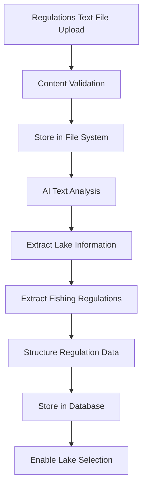

# Blazor AI Fishing Regulations Application Specification

## 1. Executive Summary

This specification outlines the development of a Blazor Server application that leverages Microsoft AI services to extract fishing regulations from text documents and present them through an intuitive lake selection interface. The application will process fishing regulations text files using AI-powered natural language processing services and allow users to select specific lakes to view their applicable fishing restrictions, seasons, and requirements.

## 2. Project Overview

### 2.1 Objectives
- Create a Blazor Server application for fishing regulations management
- Integrate Microsoft AI services for intelligent text data extraction
- Provide lake-based fishing regulation lookup functionality
- Ensure accurate and up-to-date fishing regulation information
- Deliver a responsive and user-friendly interface for anglers

### 2.2 Key Features
- Fishing regulations text file upload and processing
- AI-powered extraction of lake-specific regulations
- Interactive lake selection interface
- Comprehensive regulation display (seasons, limits, restrictions)
- Search and filter capabilities for lakes and regulations
- Mobile-responsive design for field use

## 3. Technology Stack

### 3.1 Core Technologies
- **Framework**: .NET 8 Blazor Server
- **UI Components**: Microsoft Fluent UI Blazor Components
- **AI Services**: Azure OpenAI Service for natural language processing
- **Storage**: Azure Blob Storage for document storage (optional)
- **Database**: SQL Server with Entity Framework Core
- **Authentication**: Azure Active Directory B2C

### 3.2 Development Tools
- Visual Studio 2022 or VS Code
- Azure CLI
- SQL Server Management Studio
- Postman for API testing

## 4. Architecture Design

### 4.1 High-Level Architecture
```
┌─────────────────┐    ┌─────────────────┐    ┌─────────────────┐
│   Blazor UI     │    │  Business Logic │    │   AI Services   │
│   Components    │◄──►│    Services     │◄──►│   Integration   │
└─────────────────┘    └─────────────────┘    └─────────────────┘
         │                       │                       │
         │                       │                       │
         ▼                       ▼                       ▼
┌─────────────────┐    ┌─────────────────┐    ┌─────────────────┐
│   Data Access   │    │   File Storage  │    │   External APIs │
│     Layer       │    │   (Azure Blob)  │    │  (Azure AI)     │
└─────────────────┘    └─────────────────┘    └─────────────────┘
```

### 4.2 Component Breakdown

#### 4.2.1 Presentation Layer
- **Lake Selection Component**: Interactive map and list-based lake selection
- **Regulation Display Component**: Comprehensive regulation presentation
- **Search Component**: Lake and regulation search functionality  
- **Upload Component**: Handles fishing regulations text file uploads
- **Admin Components**: Regulation management and text file processing status

#### 4.2.2 Business Logic Layer
- **Regulation Processing Service**: Orchestrates the AI extraction workflow for fishing data
- **Lake Management Service**: Manages lake data and geographic information
- **Regulation Search Service**: Handles search and filtering of regulations
- **Text File Processing Service**: Manages fishing regulations document processing

#### 4.2.3 Data Access Layer
- **Lake Repository**: CRUD operations for lake information
- **Regulation Repository**: Manages fishing regulation data
- **Document Repository**: Tracks processed regulation documents
- **Audit Repository**: Tracks regulation updates and changes

#### 4.2.4 Integration Layer
- **Azure OpenAI Client**: Handles text analysis and regulation extraction
- **Text Processing Service**: Enhances regulation data interpretation and standardization
- **Blob Storage Client**: Manages regulation document storage (optional)

## 5. Detailed Feature Specifications

### 5.1 Text File Upload and Processing

#### 5.1.1 File Upload Requirements
- **Supported Formats**: Text files (.txt, .csv) containing fishing regulations
- **File Size Limit**: Maximum 50MB per file
- **Content Requirements**: 
  - Must contain lake-specific fishing information
  - Should include regulation text and structured data
  - May contain formatted tables and lists
- **Validation Rules**:
  - File format validation
  - Size limit enforcement
  - Content verification for fishing regulation keywords

#### 5.1.2 Processing Workflow


### 5.2 AI-Powered Fishing Regulation Extraction

#### 5.2.1 Azure AI Document Intelligence Integration
- **Service Tier**: Standard tier for production use
- **Models**: 
  - Prebuilt document model for general text extraction
  - Custom model trained on fishing regulation documents
  - Table extraction for regulation data
- **Extraction Capabilities**:
  - Lake names and geographic identifiers
  - Fishing seasons and date ranges
  - Species-specific regulations
  - Bag limits and size restrictions
  - Special regulation text and conditions

#### 5.2.2 Azure OpenAI Enhancement
- **Model**: GPT-4 for natural language understanding of fishing regulations
- **Use Cases**:
  - Lake name standardization and geocoding
  - Regulation text interpretation and structuring
  - Date parsing and season calculation
  - Species name normalization
  - Regulation conflict detection and resolution

### 5.3 Lake Selection and Regulation Display

#### 5.3.1 Lake Selection Interface
- **Selection Methods**:
  - Interactive map with clickable lake markers
  - Searchable dropdown list with autocomplete
  - Geographic region-based browsing
  - Favorite lakes for quick access
- **Lake Information Display**:
  - Lake name and location details
  - Available fish species
  - Lake size and depth information
  - Access points and facilities

#### 5.3.2 Regulation Data Structure
```json
{
  "lakeRegulations": {
    "lakeId": "lake-superior",
    "lakeName": "Lake Superior",
    "location": {
      "state": "Minnesota",
      "county": "Cook County",
      "coordinates": [47.7211, -89.8794]
    },
    "fishingSeasons": [
      {
        "species": "Lake Trout",
        "openDate": "2025-01-01",
        "closeDate": "2025-09-30",
        "specialNotes": "Year-round with summer restrictions"
      }
    ],
    "bagLimits": [
      {
        "species": "Lake Trout", 
        "dailyLimit": 3,
        "possessionLimit": 6,
        "restrictions": "No more than 1 fish over 28 inches"
      }
    ],
    "sizeLimits": [
      {
        "species": "Lake Trout",
        "minimumSize": "15 inches",
        "protectedSlot": "28-36 inches"
      }
    ],
    "specialRegulations": [
      "Barbless hooks required for lake trout",
      "No live bait below 63 feet depth"
    ]
  }
}
```

### 5.4 Regulation Data Validation and Updates

#### 5.4.1 Validation Rules
- **Date Validation**: Fishing season dates and current year applicability
- **Species Validation**: Cross-reference with state fish species database
- **Regulation Consistency**: Check for conflicting regulations within lake data
- **Geographic Validation**: Verify lake locations and jurisdiction boundaries

#### 5.4.2 Data Quality Features
- **Confidence Indicators**: Visual indicators for AI extraction confidence
- **Manual Override**: Allow administrators to correct AI-extracted regulations
- **Update Tracking**: Monitor regulation changes and effective dates
- **Audit Trail**: Track all regulation updates and data sources

## 6. User Interface Design

### 6.1 Main Application Layout
- **Navigation**: Top navigation bar with breadcrumbs
- **Sidebar**: Quick access to recent documents and templates
- **Main Content Area**: Context-sensitive workspace
- **Status Bar**: Processing status and notifications

### 6.2 Key User Workflows

#### 6.2.1 Lake Selection and Regulation Viewing Workflow
1. User opens the application
2. Selects lake via map, search, or browse
3. System displays comprehensive fishing regulations
4. User can filter by species or regulation type
5. User can save lake to favorites for quick access

#### 6.2.2 Regulation Text File Processing Workflow (Admin)
1. Administrator uploads new fishing regulations text file
2. System validates document content
3. AI extracts lake and regulation data
4. Administrator reviews and validates extracted data
5. System updates lake regulations in database
6. Users see updated regulations immediately

### 6.3 Responsive Design Considerations
- **Mobile-First**: Optimized for tablets and mobile devices
- **Progressive Enhancement**: Enhanced features for larger screens
- **Accessibility**: WCAG 2.1 AA compliance
- **Performance**: Lazy loading and virtualization for large datasets

## 7. Data Models

### 7.1 Core Entities

#### 7.1.1 Lake Entity
```csharp
public class Lake
{
    public Guid Id { get; set; }
    public string Name { get; set; }
    public string State { get; set; }
    public string County { get; set; }
    public decimal Latitude { get; set; }
    public decimal Longitude { get; set; }
    public string Description { get; set; }
    public List<string> FishSpecies { get; set; }
    public DateTime LastUpdated { get; set; }
    public List<FishingRegulation> Regulations { get; set; }
}
```

#### 7.1.2 Fishing Regulation Entity
```csharp
public class FishingRegulation
{
    public Guid Id { get; set; }
    public Guid LakeId { get; set; }
    public string Species { get; set; }
    public DateTime? SeasonOpenDate { get; set; }
    public DateTime? SeasonCloseDate { get; set; }
    public int? DailyBagLimit { get; set; }
    public int? PossessionLimit { get; set; }
    public string MinimumSize { get; set; }
    public string MaximumSize { get; set; }
    public string ProtectedSlot { get; set; }
    public List<string> SpecialRegulations { get; set; }
    public decimal ConfidenceScore { get; set; }
    public bool IsValidated { get; set; }
    public DateTime EffectiveDate { get; set; }
    public string Source { get; set; }
}
```

#### 7.1.3 Regulation Document Entity
```csharp
public class RegulationDocument
{
    public Guid Id { get; set; }
    public string FileName { get; set; }
    public string OriginalName { get; set; }
    public long FileSize { get; set; }
    public string BlobUrl { get; set; }
    public DocumentStatus Status { get; set; }
    public DateTime UploadedAt { get; set; }
    public string UploadedBy { get; set; }
    public DateTime? ProcessedAt { get; set; }
    public int ExtractedLakeCount { get; set; }
    public int ExtractedRegulationCount { get; set; }
    public string RegulationYear { get; set; }
    public string IssuingAuthority { get; set; }
}
```

## 8. Security Considerations

### 8.1 Data Protection
- **Encryption in Transit**: TLS 1.3 for all communications
- **Encryption at Rest**: Azure Storage encryption for uploaded files
- **Data Retention**: Configurable retention policies for processed documents
- **GDPR Compliance**: Right to erasure and data portability

### 8.2 Access Control
- **Authentication**: Azure AD B2C integration
- **Authorization**: Role-based access control (RBAC)
- **API Security**: JWT tokens with appropriate scopes
- **Audit Logging**: Comprehensive audit trail for all operations

### 8.3 Privacy Considerations
- **Data Minimization**: Only extract and store necessary information
- **Anonymization**: Options for removing PII from processed data
- **Consent Management**: Clear consent mechanisms for data processing
- **Cross-Border Transfer**: Appropriate safeguards for international data transfer

## 9. Performance Requirements

### 9.1 Response Time Targets
- **File Upload**: < 5 seconds for files up to 10MB
- **AI Processing**: < 30 seconds for standard documents
- **Form Population**: < 2 seconds after AI processing complete
- **Page Load Times**: < 3 seconds for all pages

### 9.2 Scalability Targets
- **Concurrent Users**: Support for 100+ concurrent users
- **Document Volume**: Process 1000+ documents per day
- **Storage Capacity**: Scale to petabytes of document storage
- **Geographic Distribution**: Multi-region deployment capability

### 9.3 Availability Requirements
- **Uptime**: 99.9% availability target
- **Disaster Recovery**: RTO < 4 hours, RPO < 1 hour
- **Monitoring**: Comprehensive application and infrastructure monitoring
- **Alerting**: Proactive alerting for performance degradation

## 10. Implementation Plan

### 10.1 Development Phases

#### Phase 1: Foundation (Weeks 1-2)
- Set up development environment and CI/CD pipeline
- Create basic Blazor Server application structure
- Implement authentication and authorization
- Set up Azure resources (Storage, AI services)

#### Phase 2: Core Functionality (Weeks 3-5)
- Implement text file upload functionality
- Integrate Azure OpenAI for text processing
- Create basic regulation extraction system
- Develop data extraction and mapping logic

#### Phase 3: Enhanced Features (Weeks 6-8)
- Add Azure OpenAI integration for enhanced processing
- Implement validation and correction workflows
- Create comprehensive form template system
- Add export and reporting capabilities

#### Phase 4: Polish and Optimization (Weeks 9-10)
- Performance optimization and testing
- UI/UX refinements
- Security hardening and penetration testing
- Documentation and deployment preparation

### 10.2 Testing Strategy
- **Unit Testing**: 90%+ code coverage for business logic
- **Integration Testing**: End-to-end workflow testing
- **Performance Testing**: Load testing with realistic document volumes
- **Security Testing**: Vulnerability scanning and penetration testing
- **User Acceptance Testing**: Testing with real users and documents

### 10.3 Deployment Strategy
- **Environment Strategy**: Development → Staging → Production
- **Blue-Green Deployment**: Zero-downtime deployments
- **Feature Flags**: Gradual feature rollout capability
- **Monitoring**: Application Performance Monitoring (APM) integration

## 11. Success Metrics

### 11.1 Technical Metrics
- **Extraction Accuracy**: > 95% for standard document types
- **Processing Speed**: Average processing time < 30 seconds
- **System Availability**: > 99.9% uptime
- **User Satisfaction**: > 4.5/5 user rating

### 11.2 Business Metrics
- **Processing Volume**: Documents processed per day/month
- **Time Savings**: Reduction in manual data entry time
- **Error Reduction**: Decrease in data entry errors
- **User Adoption**: Number of active users and usage frequency

## 12. Future Enhancements

### 12.1 Planned Improvements
- **Multi-language Support**: OCR and processing for non-English documents
- **Advanced AI Models**: Integration with newer AI models as they become available
- **Mobile App**: Native mobile application for document capture
- **API Platform**: REST API for third-party integrations

### 12.2 Integration Opportunities
- **ERP Systems**: Direct integration with popular ERP platforms
- **Document Management**: Integration with SharePoint and other DMS
- **Workflow Engines**: Integration with Power Automate and Logic Apps
- **Business Intelligence**: Integration with Power BI for analytics

## 13. Conclusion

This specification provides a comprehensive roadmap for developing a Blazor Server application that leverages Microsoft AI services for intelligent text document processing and regulation extraction. The solution addresses key business needs for automated data extraction while maintaining high standards for security, performance, and user experience.

The phased implementation approach ensures manageable development cycles with incremental value delivery. The technology stack leverages Microsoft's ecosystem for seamless integration and optimal performance within Azure environments.

---

**Document Version**: 1.0  
**Last Updated**: September 3, 2025  
**Next Review**: October 3, 2025
