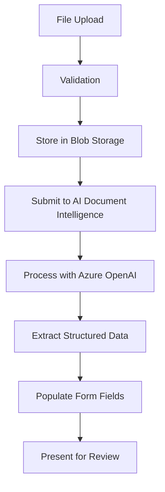

# Blazor AI PDF Form Population Specification

## 1. Executive Summary

This specification outlines the development of a Blazor Server application that leverages Microsoft AI services to extract structured data from PDF documents and automatically populate form fields. The application will provide an intuitive user interface for uploading PDF documents, processing them through AI-powered document intelligence services, and presenting the extracted data in editable forms.

## 2. Project Overview

### 2.1 Objectives
- Create a Blazor Server application for PDF document processing
- Integrate Microsoft AI services for intelligent data extraction
- Provide automatic form field population based on extracted data
- Ensure secure handling of sensitive document data
- Deliver a responsive and user-friendly interface

### 2.2 Key Features
- PDF document upload and validation
- AI-powered text and data extraction
- Dynamic form generation and population
- Data validation and correction capabilities
- Export functionality for processed data
- Audit trail and logging

## 3. Technology Stack

### 3.1 Core Technologies
- **Framework**: .NET 8 Blazor Server
- **UI Components**: Microsoft Fluent UI Blazor Components
- **AI Services**: Azure AI Document Intelligence (formerly Form Recognizer)
- **Secondary AI**: Azure OpenAI Service for natural language processing
- **Storage**: Azure Blob Storage for document storage
- **Database**: SQL Server with Entity Framework Core
- **Authentication**: Azure Active Directory B2C

### 3.2 Development Tools
- Visual Studio 2022 or VS Code
- Azure CLI
- SQL Server Management Studio
- Postman for API testing

## 4. Architecture Design

### 4.1 High-Level Architecture
```
┌─────────────────┐    ┌─────────────────┐    ┌─────────────────┐
│   Blazor UI     │    │  Business Logic │    │   AI Services   │
│   Components    │◄──►│    Services     │◄──►│   Integration   │
└─────────────────┘    └─────────────────┘    └─────────────────┘
         │                       │                       │
         │                       │                       │
         ▼                       ▼                       ▼
┌─────────────────┐    ┌─────────────────┐    ┌─────────────────┐
│   Data Access   │    │   File Storage  │    │   External APIs │
│     Layer       │    │   (Azure Blob)  │    │  (Azure AI)     │
└─────────────────┘    └─────────────────┘    └─────────────────┘
```

### 4.2 Component Breakdown

#### 4.2.1 Presentation Layer
- **Upload Component**: Handles PDF file uploads with drag-and-drop functionality
- **Form Components**: Dynamic form generation based on document type
- **Progress Component**: Shows processing status and progress indicators
- **Results Component**: Displays extracted data with editing capabilities
- **Export Component**: Provides data export in various formats

#### 4.2.2 Business Logic Layer
- **Document Processing Service**: Orchestrates the AI extraction workflow
- **Form Configuration Service**: Manages form templates and field mappings
- **Validation Service**: Handles data validation and business rules
- **Export Service**: Manages data export functionality

#### 4.2.3 Data Access Layer
- **Document Repository**: CRUD operations for document metadata
- **Form Template Repository**: Manages form configurations
- **Audit Repository**: Tracks processing history and changes

#### 4.2.4 Integration Layer
- **Azure AI Document Intelligence Client**: Handles PDF analysis and extraction
- **Azure OpenAI Client**: Processes natural language and context understanding
- **Blob Storage Client**: Manages file upload and storage

## 5. Detailed Feature Specifications

### 5.1 PDF Upload and Processing

#### 5.1.1 File Upload Requirements
- **Supported Formats**: PDF files only
- **File Size Limit**: Maximum 50MB per file
- **Upload Methods**: 
  - Drag and drop interface
  - File browser selection
  - Batch upload support (up to 10 files)
- **Validation Rules**:
  - File format validation
  - Size limit enforcement
  - Virus scanning integration
  - Password-protected PDF handling

#### 5.1.2 Processing Workflow


### 5.2 AI-Powered Data Extraction

#### 5.2.1 Azure AI Document Intelligence Integration
- **Service Tier**: Standard tier for production use
- **Models**: 
  - Prebuilt models for common documents (invoices, receipts, business cards)
  - Custom models for organization-specific documents
- **Extraction Capabilities**:
  - Text extraction with position coordinates
  - Key-value pair identification
  - Table structure recognition
  - Checkbox and signature detection

#### 5.2.2 Azure OpenAI Enhancement
- **Model**: GPT-4 for natural language understanding
- **Use Cases**:
  - Contextual field mapping
  - Data normalization and standardization
  - Ambiguity resolution
  - Quality assessment and confidence scoring

### 5.3 Dynamic Form Generation

#### 5.3.1 Form Template System
- **Template Types**:
  - Invoice processing forms
  - Contract analysis forms
  - Identity document forms
  - Custom business forms
- **Field Types**:
  - Text inputs (single/multi-line)
  - Numeric inputs with validation
  - Date pickers with format detection
  - Dropdown selections
  - Checkboxes and radio buttons
  - File attachments

#### 5.3.2 Field Mapping Configuration
```json
{
  "formTemplate": {
    "id": "invoice-template",
    "name": "Invoice Processing Form",
    "fields": [
      {
        "id": "invoiceNumber",
        "label": "Invoice Number",
        "type": "text",
        "required": true,
        "aiMapping": {
          "keywords": ["invoice number", "invoice #", "inv #"],
          "patterns": ["INV-\\d+", "\\d{6,}"]
        }
      },
      {
        "id": "totalAmount",
        "label": "Total Amount",
        "type": "currency",
        "required": true,
        "aiMapping": {
          "keywords": ["total", "amount due", "balance"],
          "patterns": ["\\$?\\d+\\.\\d{2}"]
        }
      }
    ]
  }
}
```

### 5.4 Data Validation and Correction

#### 5.4.1 Validation Rules
- **Format Validation**: Email, phone numbers, dates, currencies
- **Business Rules**: Cross-field validation, range checks
- **AI Confidence Scoring**: Highlight fields with low confidence
- **Manual Override**: Allow users to correct AI-extracted data

#### 5.4.2 Quality Assurance Features
- **Confidence Indicators**: Visual indicators for extraction confidence
- **Suggestion System**: Alternative values based on context
- **Review Workflow**: Multi-step approval process for critical documents
- **Audit Trail**: Track all changes and corrections

## 6. User Interface Design

### 6.1 Main Application Layout
- **Navigation**: Top navigation bar with breadcrumbs
- **Sidebar**: Quick access to recent documents and templates
- **Main Content Area**: Context-sensitive workspace
- **Status Bar**: Processing status and notifications

### 6.2 Key User Workflows

#### 6.2.1 Document Upload Workflow
1. User navigates to upload page
2. Selects or drags PDF files
3. System validates files and shows preview
4. User confirms upload and processing begins
5. Progress indicator shows processing status
6. Results page displays when complete

#### 6.2.2 Form Population Workflow
1. System displays extracted data in form fields
2. Confidence indicators highlight uncertain extractions
3. User reviews and corrects data as needed
4. Validation rules enforce data quality
5. User submits final form
6. System provides export and save options

### 6.3 Responsive Design Considerations
- **Mobile-First**: Optimized for tablets and mobile devices
- **Progressive Enhancement**: Enhanced features for larger screens
- **Accessibility**: WCAG 2.1 AA compliance
- **Performance**: Lazy loading and virtualization for large datasets

## 7. Data Models

### 7.1 Core Entities

#### 7.1.1 Document Entity
```csharp
public class Document
{
    public Guid Id { get; set; }
    public string FileName { get; set; }
    public string OriginalName { get; set; }
    public long FileSize { get; set; }
    public string ContentType { get; set; }
    public string BlobUrl { get; set; }
    public DocumentStatus Status { get; set; }
    public DateTime UploadedAt { get; set; }
    public string UploadedBy { get; set; }
    public DateTime? ProcessedAt { get; set; }
    public List<ExtractedData> ExtractedData { get; set; }
}
```

#### 7.1.2 Form Template Entity
```csharp
public class FormTemplate
{
    public Guid Id { get; set; }
    public string Name { get; set; }
    public string Description { get; set; }
    public string TemplateJson { get; set; }
    public bool IsActive { get; set; }
    public DateTime CreatedAt { get; set; }
    public DateTime UpdatedAt { get; set; }
    public List<FormField> Fields { get; set; }
}
```

#### 7.1.3 Extracted Data Entity
```csharp
public class ExtractedData
{
    public Guid Id { get; set; }
    public Guid DocumentId { get; set; }
    public string FieldName { get; set; }
    public string FieldValue { get; set; }
    public decimal ConfidenceScore { get; set; }
    public string ExtractionSource { get; set; }
    public bool IsValidated { get; set; }
    public string CorrectedValue { get; set; }
    public DateTime ExtractedAt { get; set; }
}
```

## 8. Security Considerations

### 8.1 Data Protection
- **Encryption in Transit**: TLS 1.3 for all communications
- **Encryption at Rest**: Azure Storage encryption for uploaded files
- **Data Retention**: Configurable retention policies for processed documents
- **GDPR Compliance**: Right to erasure and data portability

### 8.2 Access Control
- **Authentication**: Azure AD B2C integration
- **Authorization**: Role-based access control (RBAC)
- **API Security**: JWT tokens with appropriate scopes
- **Audit Logging**: Comprehensive audit trail for all operations

### 8.3 Privacy Considerations
- **Data Minimization**: Only extract and store necessary information
- **Anonymization**: Options for removing PII from processed data
- **Consent Management**: Clear consent mechanisms for data processing
- **Cross-Border Transfer**: Appropriate safeguards for international data transfer

## 9. Performance Requirements

### 9.1 Response Time Targets
- **File Upload**: < 5 seconds for files up to 10MB
- **AI Processing**: < 30 seconds for standard documents
- **Form Population**: < 2 seconds after AI processing complete
- **Page Load Times**: < 3 seconds for all pages

### 9.2 Scalability Targets
- **Concurrent Users**: Support for 100+ concurrent users
- **Document Volume**: Process 1000+ documents per day
- **Storage Capacity**: Scale to petabytes of document storage
- **Geographic Distribution**: Multi-region deployment capability

### 9.3 Availability Requirements
- **Uptime**: 99.9% availability target
- **Disaster Recovery**: RTO < 4 hours, RPO < 1 hour
- **Monitoring**: Comprehensive application and infrastructure monitoring
- **Alerting**: Proactive alerting for performance degradation

## 10. Implementation Plan

### 10.1 Development Phases

#### Phase 1: Foundation (Weeks 1-2)
- Set up development environment and CI/CD pipeline
- Create basic Blazor Server application structure
- Implement authentication and authorization
- Set up Azure resources (Storage, AI services)

#### Phase 2: Core Functionality (Weeks 3-5)
- Implement PDF upload functionality
- Integrate Azure AI Document Intelligence
- Create basic form generation system
- Develop data extraction and mapping logic

#### Phase 3: Enhanced Features (Weeks 6-8)
- Add Azure OpenAI integration for enhanced processing
- Implement validation and correction workflows
- Create comprehensive form template system
- Add export and reporting capabilities

#### Phase 4: Polish and Optimization (Weeks 9-10)
- Performance optimization and testing
- UI/UX refinements
- Security hardening and penetration testing
- Documentation and deployment preparation

### 10.2 Testing Strategy
- **Unit Testing**: 90%+ code coverage for business logic
- **Integration Testing**: End-to-end workflow testing
- **Performance Testing**: Load testing with realistic document volumes
- **Security Testing**: Vulnerability scanning and penetration testing
- **User Acceptance Testing**: Testing with real users and documents

### 10.3 Deployment Strategy
- **Environment Strategy**: Development → Staging → Production
- **Blue-Green Deployment**: Zero-downtime deployments
- **Feature Flags**: Gradual feature rollout capability
- **Monitoring**: Application Performance Monitoring (APM) integration

## 11. Success Metrics

### 11.1 Technical Metrics
- **Extraction Accuracy**: > 95% for standard document types
- **Processing Speed**: Average processing time < 30 seconds
- **System Availability**: > 99.9% uptime
- **User Satisfaction**: > 4.5/5 user rating

### 11.2 Business Metrics
- **Processing Volume**: Documents processed per day/month
- **Time Savings**: Reduction in manual data entry time
- **Error Reduction**: Decrease in data entry errors
- **User Adoption**: Number of active users and usage frequency

## 12. Future Enhancements

### 12.1 Planned Improvements
- **Multi-language Support**: OCR and processing for non-English documents
- **Advanced AI Models**: Integration with newer AI models as they become available
- **Mobile App**: Native mobile application for document capture
- **API Platform**: REST API for third-party integrations

### 12.2 Integration Opportunities
- **ERP Systems**: Direct integration with popular ERP platforms
- **Document Management**: Integration with SharePoint and other DMS
- **Workflow Engines**: Integration with Power Automate and Logic Apps
- **Business Intelligence**: Integration with Power BI for analytics

## 13. Conclusion

This specification provides a comprehensive roadmap for developing a Blazor Server application that leverages Microsoft AI services for intelligent PDF document processing and form population. The solution addresses key business needs for automated data extraction while maintaining high standards for security, performance, and user experience.

The phased implementation approach ensures manageable development cycles with incremental value delivery. The technology stack leverages Microsoft's ecosystem for seamless integration and optimal performance within Azure environments.

---

**Document Version**: 1.0  
**Last Updated**: September 3, 2025  
**Next Review**: October 3, 2025
