# Fishing Regulations Process Flow Documentation

## Overview

This document outlines the high-level process flows for the Blazor AI Fishing Regulations application. The system has two primary workflows:

1. **PDF Ingestion Process** - Converting fishing regulations PDFs into structured, searchable data
2. **Lake Regulation Lookup Process** - Allowing users to select lakes and view regulations

## Process Flow 1: PDF Ingestion and Data Extraction

### High-Level Flow Diagram

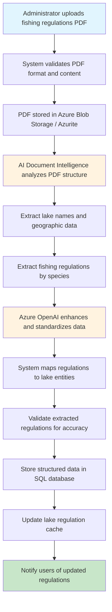

### Detailed Process Steps

#### Phase 1: Document Upload and Validation
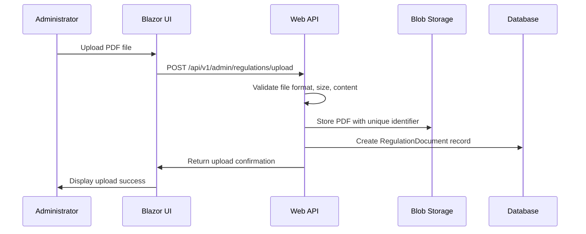

#### Phase 2: AI Processing and Data Extraction
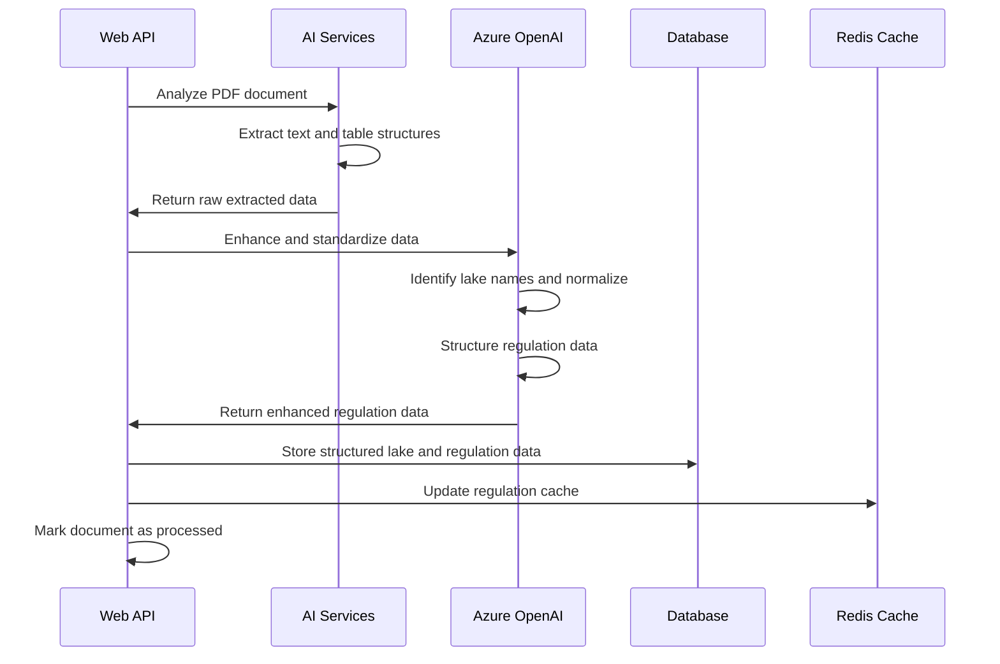

#### Phase 3: Data Validation and Quality Assurance
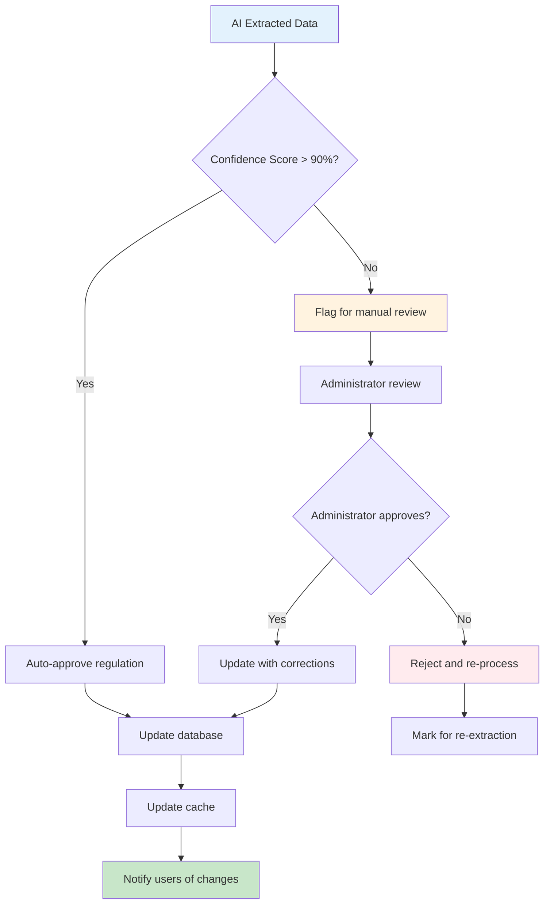

## Process Flow 2: Lake Selection and Regulation Lookup

### High-Level Flow Diagram

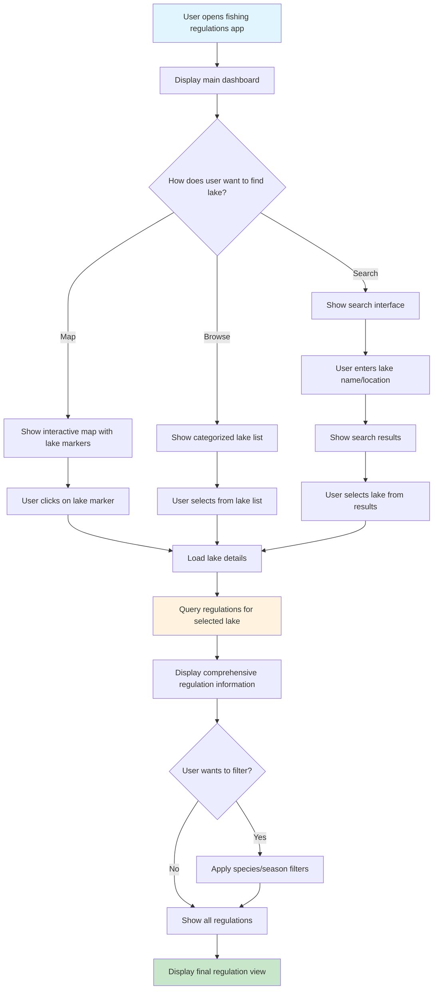

### Detailed User Interaction Flow

#### Lake Selection Interface
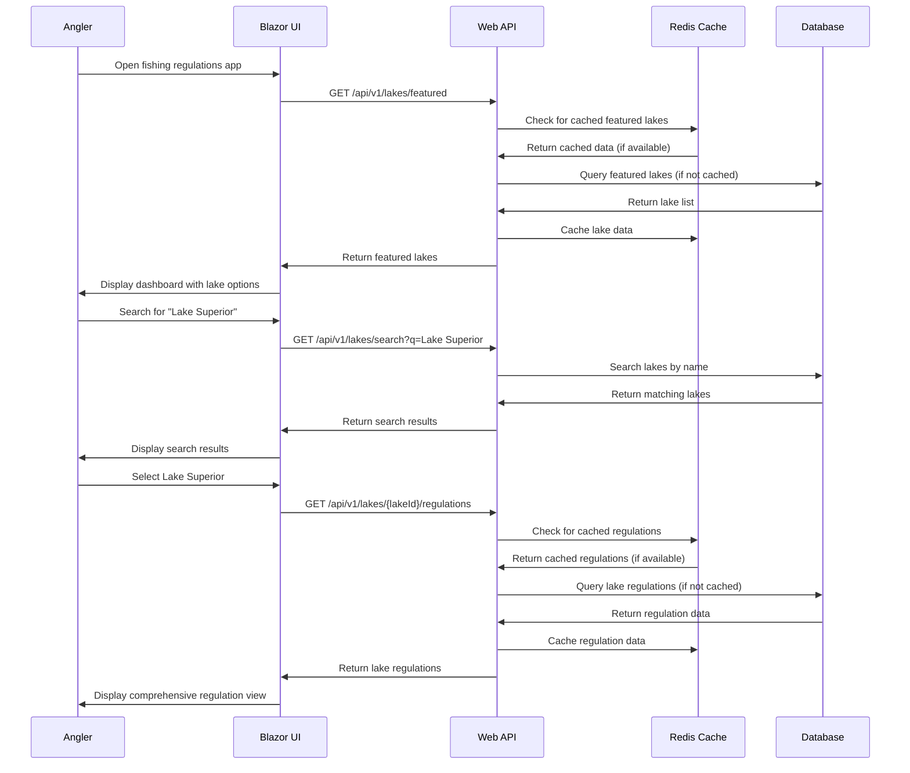

#### Regulation Display and Filtering
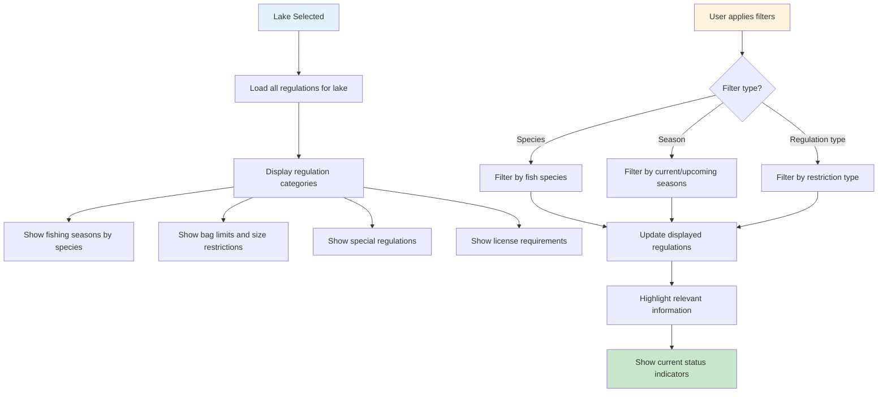

## Data Flow Architecture

### System Data Flow
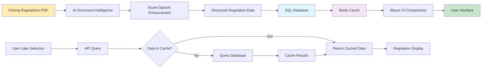

## Integration Points and Dependencies

### External Service Integration
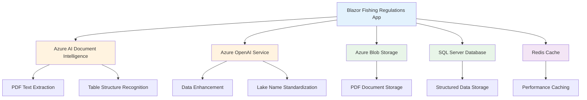

## Error Handling and Recovery

### Error Flow Diagram
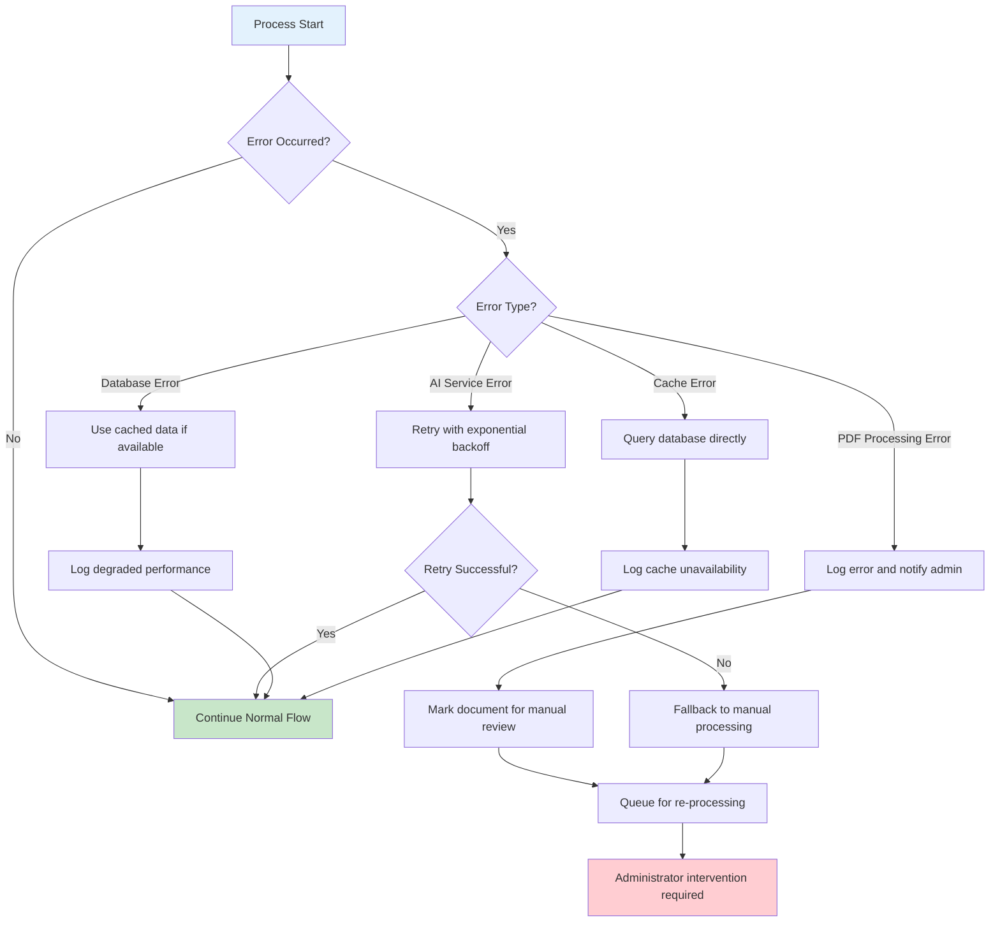

## Performance Optimization Flow

### Caching Strategy
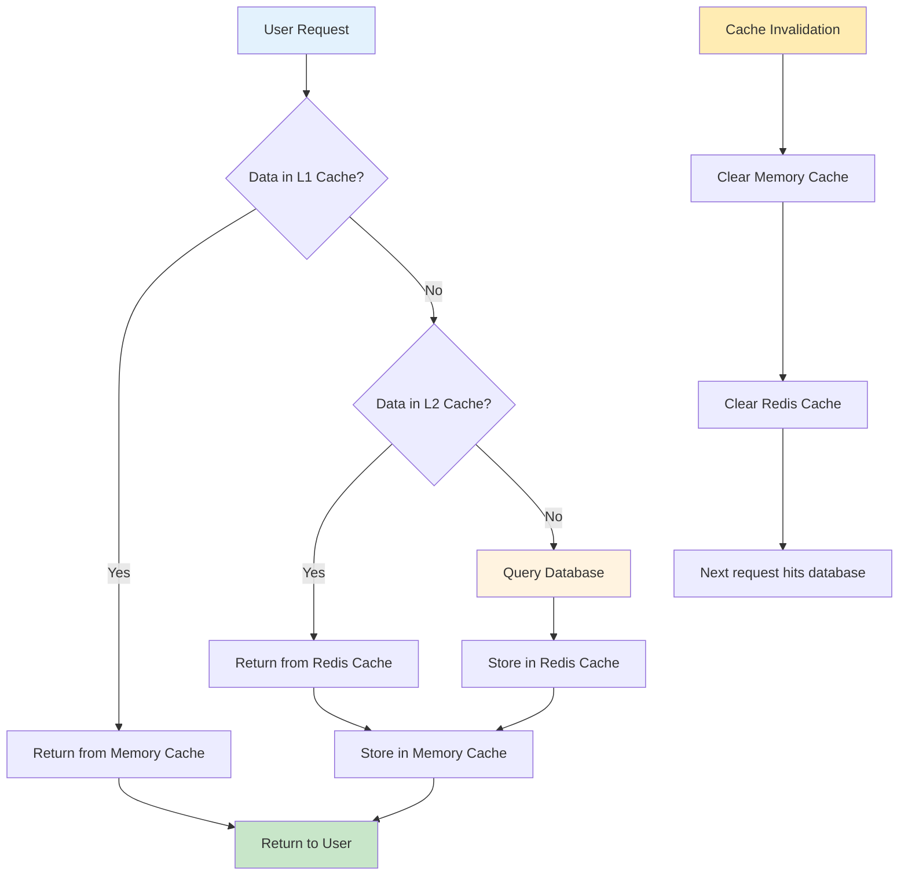

## Monitoring and Metrics

### Process Monitoring Points
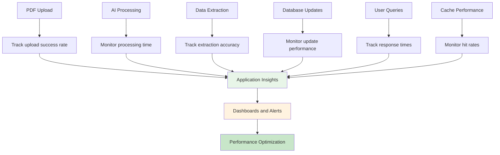

## Security Considerations

### Security Flow
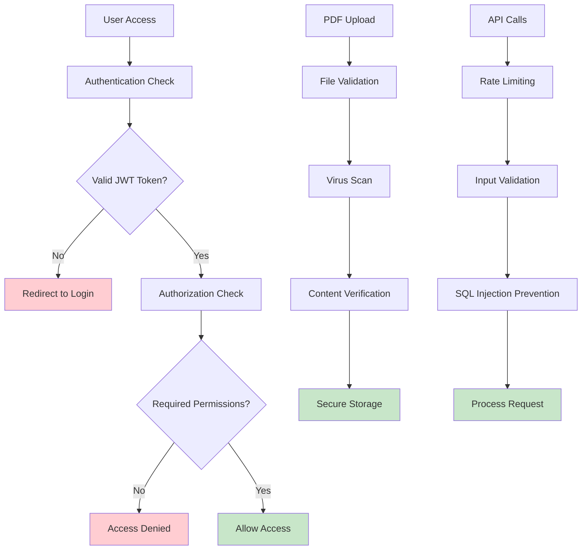

## Conclusion

These process flows provide a comprehensive view of how the Blazor AI Fishing Regulations application operates:

1. **PDF Ingestion** transforms unstructured regulation documents into searchable, structured data through AI processing
2. **Lake Selection** provides users with intuitive ways to find and view regulations for specific fishing locations

The flows are designed for scalability, reliability, and user experience, with proper error handling, caching strategies, and security measures throughout the process.
